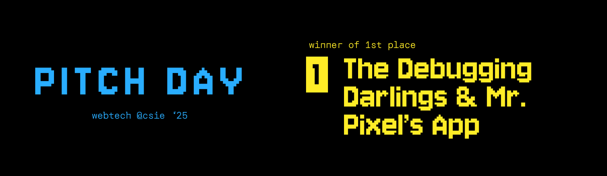

  
  <b>PITCH DAY 25’</b> was an event where projects of Webtech @CSIE students presented the projects they worked on the entire semester. Participant students were prompted to specify the amount of fictitious money they would invest in a project, based on their personal criteria. The leaderboard was created based on the amount of money raised by each project.

# Feedback-App
